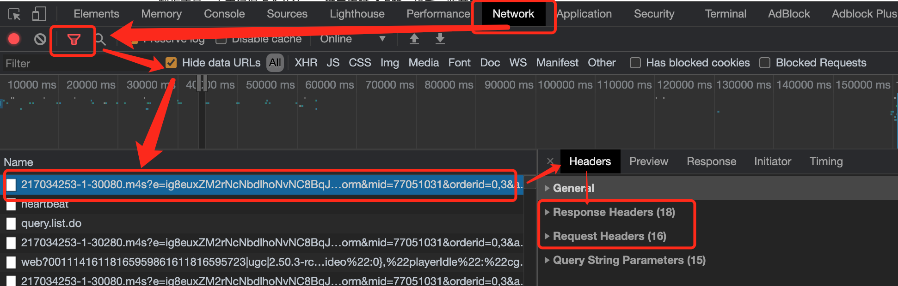

## HTTP

### 报文

**请求报文**

​	**重点：格式和参数**

```
行	请求类型: GET/POST URL: s?ie=utf-8   HTTP/1.1
头	Host: ***.com/IP
	 Cookie: name=admin
 	 Content-Type: application/x-www-from-urlencoded
 	 User-Agent: chrome 83
空行
体
```

**相应报文**	

```
行  HTTP/1.1  200/400/500 OK  // 协议类型/版本  状态码  状态字符串
头	 Content-Type: text/html;charset=utf-8  // 类型/格式
		Content-Length: 2048  // 长度
		Content-encoding: zip  // 压缩方式

空行
体   <html>
       <head>
       </head>
       <body>
         <p>HTTP报文内容</p>
       </body>
     </html>
```

### Chrome中查看



### express

express.js

```js
// 1 引入express
const express = require('express')

// 2 创建应用对象
const app = express()

// 3 创建路由规则
app.get('/', (request, response) => {
  // 设置响应
  response.send('Hell Express')
})

// 4 监听端口启动服务
app.listen(8000, () => {
  console.log('服务已启动，监听中……');
})
```

启动：右击 express.js	在集成终端中打开	输入命令: node express.js	显示：服务已启动，监听中……

查看：浏览器中输入 http://127.0.0.1:8000/  显示：Hell Express


### GET请求

```js
<script>
  // GRT
  var btn = document.getElementsByClassName('btn')[0]
  var res = document.getElementsByClassName('box')[0]
  btn.onclick = function(){
    // 1 创建对象
    var xhr = new XMLHttpRequest()
    // 2 设置请求方法和URL
    xhr.open('GET', 'http://127.0.0.1:8000/server?a=100&b=200')  // 传参
    // 3 发送
    xhr.send()
    // 4 事件绑定 处理返回结果
    // readystate 是 xhr 对象实例中的属性，表示状态
    // readystate 0初始状态， 1open方法调用完毕 ，2send方法调用完毕，3服务费返回部分结果，4服务端返回所有结果
    // change 状态改变触发，总共4次，
    xhr.onreadystatechange = function(){
      if(xhr.readyState === 4){  // 判断服务端全部返回
        // 5 判断响应状态码
        if(xhr.status >= 200 && xhr.status < 300 ){
          // 6 处理服务端返回结果
          console.log(xhr.status)    // 响应状态码
          console.log(xhr.statusText)  // 响应字符串
          console.log(xhr.getAllResponseHeaders()) // 响应头
          console.log(xhr.response)

          // 7 获取服务端返回结果
          res.innerHTML = xhr.response
        }
      }
    } 
  }
</script> 
```


### POST请求

express.js  app.get() => app.post()

```js
<script>
  // POST
  var box2 = document.getElementsByClassName('box2')[0]
  box2.onmouseover = function(){
    var xhr2 = new XMLHttpRequest()
    xhr2.open('POST', 'http:127.0.0.1:8000/server?user=admin&b=200&c=300')
    xhr2.send('字符')
    xhr2.onreadystatechange = function(){
      if(xhr2.readyState ===4){
        if(xhr2.status >= 200 && xhr2.status < 300){
          box2.innerHTML = xhr2.response
        }
      }
    }
  }
</script>
```

### setRequestHeader

```js
<script>
  // POST
  var box2 = document.getElementsByClassName('box2')[0]
  box2.onmouseover = function(){
    var xhr2 = new XMLHttpRequest()
    xhr2.open('POST', 'http:127.0.0.1:8000/server?user=admin&b=200&c=300')
    // xhr2.setRequestHeader('Content-Type', 'application/x-www-form-urlencoded') //  设置请求头，可自定义
    xhr2.setRequestHeader('name', 'myValue')
    // 报错
    // express中设置响应头 所有类型都可以接受
    // response.setHeader('Access-Control-Allow-Headers', '*')
    xhr2.send()
    xhr2.onreadystatechange = function(){
      if(xhr2.readyState ===4){
        if(xhr2.status >= 200 && xhr2.status < 300){
          box2.innerHTML = xhr2.response
        }
      }
    }
  }
</script>
```

express.js

> 设置响应头 所有类型都可以接受 且post改为all

```js
app.all('/server', (request, response) => {
  // 设置响应头  设置允许跨域
  response.setHeader('Access-Control-Allow-Origin', '*')
  // 设置响应头 所有类型都可以接受 且post改为all
  response.setHeader('Access-Control-Allow-Headers', '*')

  // 设置响应体 * 设置post参数
   response.send('POST: Hell Express')
})
```


## 返回JSON

 **express.js**

```js
app.get('/json', (request, response) => {
  response.setHeader('Access-Control-Allow-Origin', '*')
  var data = {
    name: 'admin',
    password: '123456'
  }
  //  对象类型转为json字符串
  var str = JSON.stringify(data)
  response.send(str)
})
```

### 手动转化

```
var newData = JSON.parse(xhr3.response)
box3.innerHTML = '用户名：' + newData.name + '<br>密码：' + newData.password
```

### 自动转化

```
xhr3.responseType = 'json'
box3.innerHTML = '自动转化JSON<br>用户名：' + xhr3.response.name + '<br>密码：' + xhr3.response.password
```

**完整代码**

```js
<script>
  var btn3 = document.getElementsByClassName('btn3')[0]
  var box3 = document.getElementsByClassName('box3')[0]
  btn3.onclick = function(){
    var xhr3 = new XMLHttpRequest()
    xhr3.responseType = 'json'  // json自动转换 设置
    xhr3.open('GET', 'http://127.0.0.1:8000/json') 
    xhr3.send()
    xhr3.onreadystatechange = function(){
      if(xhr3.readyState === 4){
        if(xhr3.status >= 200 && xhr3.status <300){
          console.log('json返回成功');
          // box3.innerHTML = xhr3.response
          // 手动转化返回的json数据需要转化
          //var newData = JSON.parse(xhr3.response)
          // box3.innerHTML = '用户名：' + newData.name + '<br>密码：' + newData.password

          // 自动转换
          box3.innerHTML = '自动转化JSON<br>用户名：' + xhr3.response.name + '<br>密码：' + xhr3.response.password
         }
      }
    }
  }
</script>
```

## nodemon

自动启动服务，避免改动express.js后频繁手动重启

```
安装  npm install -g nodemon
```

使用： express.js所在文件夹	右击-在终端中打开	命令行: nodemon express.js

## 请求异常

### IE缓存问题

> IE会缓存Ajax请求

```js
xhr4.open('GET', 'http://127.0.0.1:8000/ie?t='+Date.now())  //  解决IE缓存
```

### 网络超时回调

```js
// 超时设置
xhr5.timeout = 2000
// 超时重调
xhr5.ontimeout = function(){
	box5.innerHTML = '超时了'
}
```

### 网络异常回调

```js
//  网络异常回调
xhr5.onerror = function(){
  box5.innerHTML = '网络异常'
}
```

### 取消请求

```js
var xhr6 = null  // 需定义在外部，不然取消请求无法使用
box6_1.onclick = function(){
  // 执行发送请求
})
box6_2.onclick = function(){
	xhr6.abort()  // 取消请求
}
```

### 重复发送请求


